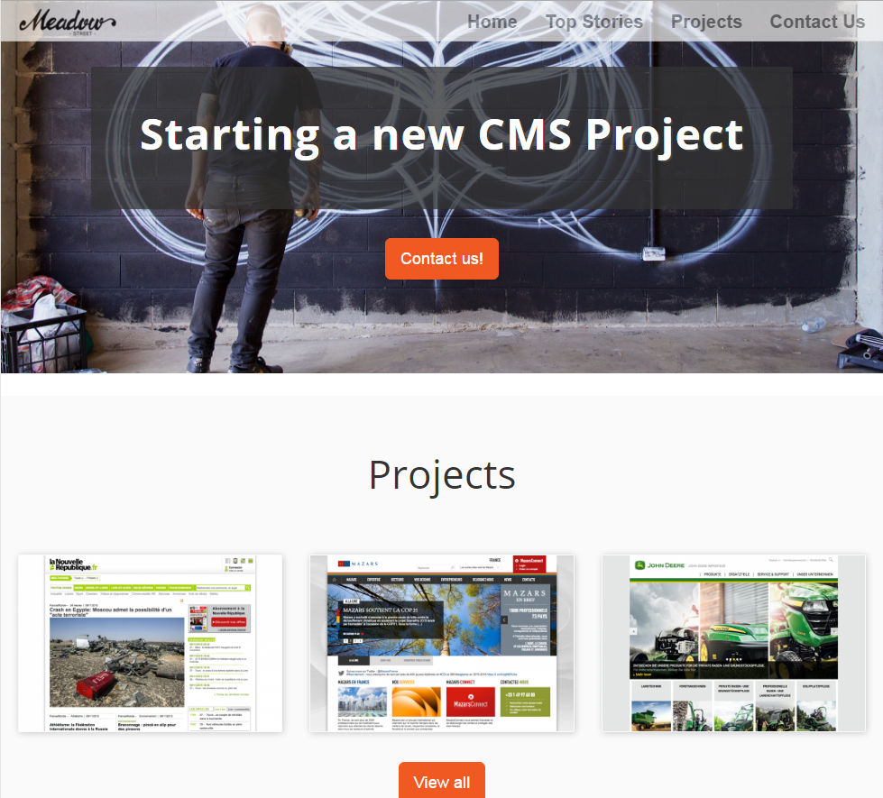

#  eZ Platform Demo

When installing eZ Platform you have two distributions to choose from: you can select a clean installation which is empty and instantly ready for you to start working on your own website. Alternatively, you can choose to install a Demo, a sample website that lets you look around and get to know the system.

[Installing the Demo](using-composer-to-install-the-demo/) is very similar to [creating a clean installation](step-1-installation/).

 

### What's in the Demo?

The Demo is a showcase of the capabilities of the system. You can use it to familiarize yourself with the way eZ Platform works, organizes its content model and structures projects.

Feel free to dabble and experiment with your demo installation. However, if you are planning to start working on your actual project, it is recommended to make a clean installation of eZ Platform (without the demo).

Demo and clean versions of eZ Platform are stored in separate repositories on GitHub: <https://github.com/ezsystems/ezplatform> and <https://github.com/ezsystems/ezplatform-demo>.

 

