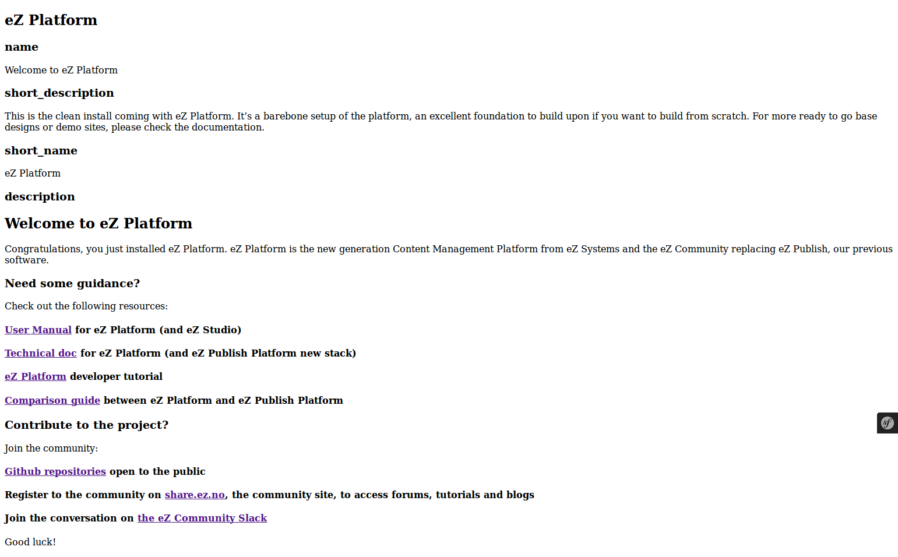

#  Step 1 - Getting Ready

eZ Platform is a new CMS written in PHP5 using Symfony2 Full Stack.

You will need a web server, a relational database and PHP5.x+ in order to follow this tutorial. An \*AMP web server is sufficient. You can use a local server on your own computer.

Once you have [installed eZ Platform](../getting-started/step-1-installation/), [configured your server](../getting-started/step-0-requirements-and-system-configuration), and created your database (see aside) [started your web server](../getting/started/web-server), you need to create a database for this tutorial.

Tip: you can use [the local PHP built-in web server](../phps-built-in-server) for this Tutorial!

!!! note "Database Creation"

    In this tutorial, we'll use the database name "`ezplatformtutorial`".

    You can create this using a GUI tool, or on the command line. For MySQL you can use this query: `` `CREATE DATABASE ezplatformtutorial CHARACTER SET UTF8` ``. You can perform the equivalent action on the database of your choice. We've seen good results with MariaDB, PostgreSQL, and others.

## Now you are ready to begin the Tutorial!

As we did a clean install, the root content will be displayed using the default content view template.

We will customize this default content view template in the next steps. After that, we'll create your Content Model and populate your content tree.
