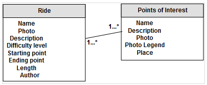
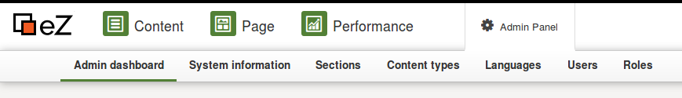

#  Step 2 - Create your content model

[TOC]

How your content is structured is a very important part of an eZ Platform project. Think of it as the database design of your application. We recommend that you read the [Under the hood, concepts and organization](..\guide\under-the-hood---how-ez-platform-works) documentation page, but you can also read the paragraph below for a short, straight-to-the-point introduction.

## Content Model Overview

The eZ Platform content repository is centered around **Content items**, pieces of content: an article, a product review, a place...

Every Content item is built based on *blueprints*, called **Content Types**. They are named entities that define what information makes up a particular type of content: *article*, *product review*, *place*. An article could include a *title*, a main *image*, an *abstract*, the *article's body*, a *publication date*, and a *list of authors*. Those named entities are called **Field Definitions**, as they define what Fields a Content item is made of. A Field Definition sets the main information of a field: name, identifier, and type. Any Content Type can also be a **container**, meaning that it can act as a "directory", and contain other Content items.

The available Types for Field Definitions can be any of the installed **Field Types**, about 30 in the default distribution. Each is built to represent a specific type of content field: a text, a block of rich text, an image, a collection of relations to Content items, etc. You can find a complete list in the [Field Types reference](Field-Types-reference_31430495.html) section. Every Field Type may have its own options, and comes with its own editing and viewing interfaces.

According to what you want to store, and what you want to do with it, you will create a set of Content Types and populate the **Content Tree** with them.

## Create your Content Types

The site will use two Content Types: **Ride** and **Point of interest**

Go to the admin interface ("&lt;yourdomain&gt;/ez"), and authenticate with the default username: `admin` and the default password : `publish`. 

Click on **Admin Panel** in the Navigation hub, and choose **Content types** in the sub menu:

You will see a list of **Content Type Groups**. They are used to group content types in a logical way.

Click on **Content** and then click on **Create a content type**. 

We will create the Ride Content Type first:

#### Create the Ride Content Type

A bike ride, with a description and some extra info, like who took this ride for the first time, or points of interest it goes through.

Fill the form with this basic info: 

**Name**: Ride
**Identifier**: ride
**Content name pattern**: &lt;name&gt; 

Then create all fields with the following information: 

| Name             | Identifier      | Field Type   | Required | Searchable | Translatable | Others                                                             |
|------------------|-----------------|--------------|----------|------------|--------------|--------------------------------------------------------------------|
| Name             | name            | Text line    | yes      | yes        | yes          |                                                                    |
| Photo            | photo           | Image        | no       | no         | no           |                                                                    |
| Description      | description     | Rich text    | yes      | yes        | yes          |                                                                    |
| Difficulty level | level           | Selection    | yes      | yes        | no           | Add a couple of Levels, such as "beginner, intermediate, advanced" |
| Starting point   | starting\_point | Map location | yes      | yes        | no           |                                                                    |
| Ending point     | ending\_point   | Map location | yes      | yes        | no           |                                                                    |
| Length           | length          | Integer      | yes      | yes        | no           |                                                                    |
| Author           | author          | Authors      | no       | yes        | yes          |                                                                    |

## Populate your Content tree

Go back to the Content tree and create a Folder named *All Rides* using the **Create** button in the Action bar on the right of the screen.

In the folder, create a couple of Rides, using the Create button, being on the Content "All Rides" so the new Content will be created as a child directly. Don't worry, if you created the Content elsewhere, you can move it later.

## Ready for Step 3

You have now : 2 Rides (or more) in a Folder and are ready to customize the Homepage of your Go Bike website!
